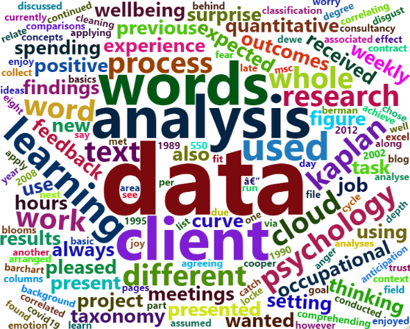

```{r setup, include=FALSE}
knitr::opts_chunk$set(echo = TRUE)
```

# Introduction

Part of my MSc in Occupational Psychology required spending 60 hours in work
experience for the Applying Psychology to Work and Organisations module. Since I
was doing this degree full-time and do not currently have a job to relate the
experience to, I was offered a series of projects and chose a data analysis one
that had not been looked at. Due to Covid19 restrictions, the whole process was
conducted remotely. I had always assumed spending 10 hours per week on this
project (a ‘normal’ working day, right?); and once I had met the client on
Teams, we arranged weekly meetings to monitor progress and exchange information.

# The job

I had, perhaps naively, expected pages of numerical data, thinking I could run
various quantitative statistical analyses to present my findings. Imagine my
surprise when I received an Excel file with columns of text! Not to worry
though, I enjoy both quantitative and qualitative research/data. The client
graciously explained the purpose and reasoning behind the data; and we discussed
what the expected outcomes should be. Their intention was to potentially improve
procedures in how they write, collect and review feedback on outcomes of
learning. This was a new learning curve for me in comprehending this discipline,
as my previous professional background was technical/electrical field work.

# Procedure

In the previous year I had learned the basics of R-programming with RStudio and
thought I would incorporate this learning for the task, using RMarkdown to
present the findings. This was my next learning curve as I had to research
different techniques to apply for what I wanted to achieve. After ‘cleaning’ the
data in order to analyse it, I found some useful
[text-mining](https://www.red-gate.com/simple-talk/sql/bi/text-mining-and-sentiment-analysis-with-r/)
functions to use, which I manipulated to fit the data. Frequently used words in
the data were presented in bar-chart; and more commonly, word cloud formats (see Figure 1). 

<br>

```{r, echo=FALSE, out.width="75%", fig.align="center", fig.cap="<br>__Figure 1.__ _Example word cloud of this blog_."}

```

<br>

Then the frequently used words were correlated with associated words in the data
to show context. A sentiment analysis showed how positive or negative the text
was, along with an emotion classification using eight basic emotions (anger,
fear, anticipation, trust, surprise, sadness, joy, and disgust).

The client was pleased with the results, however, during our weekly ‘catch-up’
meetings I was reminded of another area they wanted exploring. This included how
their use of words correlated with Bloom’s Taxonomy; a hierarchical framework of
words used for different levels of thinking – or rather, a sample list used by
the client.

This particular analysis focused on word cloud comparisons between the
‘Taxonomy’ and the textual data. The results were interesting and were also
presented as percentage tables, giving the client ideas for improving feedback.
The whole project was received well; and the client was surprised at the depth
of analysis; and also pleased with the different concepts used. Suffice to say,
I enjoyed the whole process.

# Relating the task to Occupational Psychology

Goal setting theory: to maintain motivation and a positive effect on performance
[@locke1990TheoryGoalSetting; @locke2002BuildingPracticallyUseful].

The consultancy cycle: agreeing the ‘contract’, setting expectations,
identifying, implementing and evaluating solutions.

Data analysis: Always a process in psychological research.

Wellbeing: maintaining my personal wellbeing [@dewe2012WellBeingWorkBalanced],
particularly engaging with natural surroundings
[@berman2008CognitiveBenefitsInteracting;
@kaplan1989ExperienceNaturePsychological; @kaplan1995RestorativeBenefitsNature]

<br>
```{r, echo=FALSE, out.width="100%"}


```


<br>

# References


