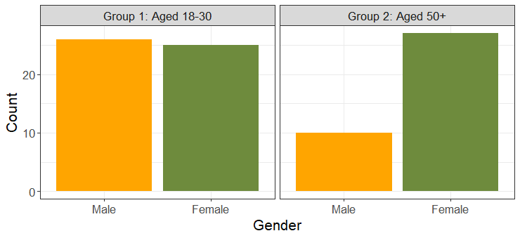

```{r setup, include=FALSE}
knitr::opts_chunk$set(echo = FALSE,
                      warning = FALSE,
                      message = FALSE,
                      fig.align = "center")

```

```{r libraries}
library(tidyverse)

```


<br>

<center>**Engagement at Work: Investigating the Relationships Between\
Age-Groups, Gender, Personality; and Trait Emotional Intelligence**

<br>

Stuart M. Leeds and Ben Steeden [supervisor]

<br>

Faculty of Health and Applied Sciences, Department of Health and Social
Sciences,  
University of the West of England (UWE), Bristol</center>

<br>
<br>

**Purpose:** To add to and extend existing research of engagement at work with
new findings regarding age-groups, gender, personality; and trait emotional
intelligence (TEI).

**Design:** A cross-sectional correlation study with added mediator and
moderator analyses. Exploratory analyses include two-tailed correlation,
hierarchical multiple linear regression and additional mediator analysis.

A simple research question reflects the title:

>_What is the relationship between age-groups, gender, personality, TEI and; engagement at work?_

The introduction begins with a general overview of engagement at work with an
original description and then offers a modernised definition suggesting that
engagement is a state of mind where people work hard because they enjoy it,
rather than being a static state. Engagement is then characterised by three
dimensions: *vigour, dedication* and *absorption*, defining how engaged
employees approach work; and gives examples of necessary workplace requirements
for the positive benefits of engagement to occur. Some positive and negative
aspects of engagement are discussed, from individual well-being, to exhaustion
and burnout. Criticism of engagement measures is introduced suggesting an
over-accentuation of positive aspects which negate the reality of occupational
conflict. Then examples of lack of engagement among UK employees are given using
the Gallup 2021 State of the Global Workplace Report, followed by examples of
previous research showing that engagement can be affected and predicted by
various individual differences. The remaining variables (*age-groups and gender,
personality; and TEI*) are described; and their use in the research is justified.
Three hypotheses are given:

  - **Hypothesis H1:** The personality traits Openness to experience,
    Conscientiousness, Extroversion, Agreeableness and Emotional Stability will
    be positively correlated to work engagement.

  - **Hypothesis H2:** There will be a significantly positive relationship
    between age-groups and engagement mediated by higher TEI.
 
  - **Hypothesis H3:** Gender will moderate the relationship between age-groups
    and TEI such that it will be stronger for females than males.

$159$ volunteers were recruited via bespoke online surveys measuring the usual
demographics, personality, TEI; and work engagement of which $88$ participants
were used in the analysis. These were arranged into two age groups: 

* __Group 1:__ $51$ participants ($25$ females and $26$ males aged $18-30$).

* __Group 2:__ $37$ participants ($27$ females and $10$ males aged $50$ and above). 

<br>

```{r , group, echo=FALSE, out.width="80%", fig.cap="**Figure 1.** *Participant Numbers by Age-group and Gender*"}

```

<br>

<u>__Of the main results:__</u>

  - H1 was partially supported in that those participants with higher
    conscientiousness, agreeableness and emotional stability were more likely to
    be engaged at work. No relationship was found between engagement and
    extraversion or openness to experience (see Figure 2).

  - H2 was not supported in that the relationship between age-groups and
    engagement is not mediated by higher TEI.

  - H3 was not supported in that the relationship between age-groups and TEI is
    not moderated by gender.

``` {r h1_plot, echo=FALSE, out.width="80%", fig.cap="**Figure 2.** *H1 Correlations between Engagement and Personality*.<br>_Note:_ 1= Engagement, 2= Extraversion, 3=Agreeableness, 4= Conscientiousness, <br>5= Emotional Stability, 6= Openness to Experience. _N_= 88; * _p_ < .05; ** _p_ < .01."}
knitr::include_graphics("./images/H1_wide.png")
```

<br>

<u>**Exploratory results**</u>

  - Conscientiousness, emotional stability and agreeableness are the dominant
    personality traits that relate to engagement and each of its three
    dimensions.

  - Older workers have a higher TEI which also predicts engagement, though older
    workers are not more engaged *because* of a higher TEI.

  - Females from both age-groups are more likely to have higher TEI along with
    wellbeing and emotionality than males and therefore, are also more likely to
    be engaged at work.

  - TEI mediates the relationship between gender and engagement in support of
    female workers from both age-groups.

  - Conscientiousness and gender (females in both age-groups) predict engagement
    at work. TEI accounts for $23\%$ variance, an increase of $5\%$.

<br>

<u>**Implications**</u>

1.  **Theoretical:**
      - Engagement theory is partially supported since personality can change in
        different circumstances, so one might be more engaged in their job at
        one time and not the next.
      - There is no direct support for older workers being engaged, but they
        might be engaged indirectly through various personality traits.

2.  **Applied:**
      - Recognise disengagement at work and offer support, especially for males
        (due to lack of support in this study).
      - Implement emotional intelligence training programmes to improve
        wellbeing; and reduce stress and anxiety at work.

*****

Questions or additional information requests to be directed to [the main author.](mailto:sleeds40@gmail.com)

This summary is also published at [ProjectMatch(/blog)](https://www.project-match.com/about/): _"Connecting business and students for great project partnerships"._

<br>